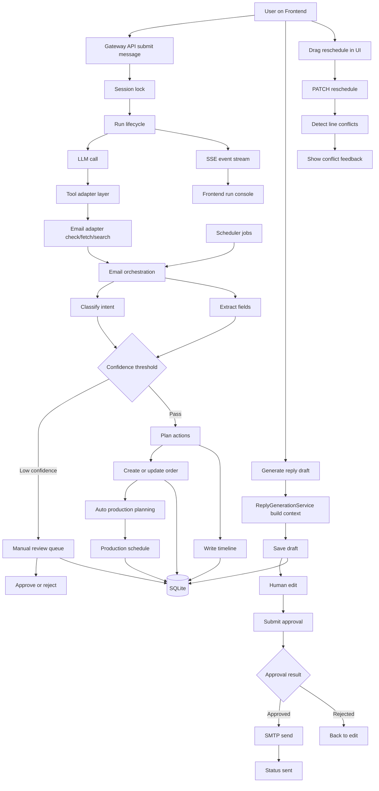

# RiceWatcher AI Agent Workflow

```mermaid
flowchart TD
    U[User on Frontend] --> G1[Gateway API submit message]
    G1 --> G2[Session lock]
    G2 --> G3[Run lifecycle]
    G3 --> LLM[LLM call]
    LLM --> T[Tool adapter layer]
    T --> ECHK[Email adapter check/fetch/search]
    G3 --> SSE[SSE event stream]
    SSE --> UI[Frontend run console]

    ECHK --> ORCH[Email orchestration]
    ORCH --> C1[Classify intent]
    ORCH --> C2[Extract fields]
    C1 --> TH{Confidence threshold}
    C2 --> TH

    TH -->|Low confidence| RQ[Manual review queue]
    RQ --> RQA[Approve or reject]

    TH -->|Pass| PLAN[Plan actions]
    PLAN --> ORD[Create or update order]
    PLAN --> TL[Write timeline]

    U --> RD1[Generate reply draft]
    RD1 --> RD2[ReplyGenerationService build context]
    RD2 --> DR[Save draft]
    DR --> EDIT[Human edit]
    EDIT --> SUB[Submit approval]
    SUB --> APV{Approval result}
    APV -->|Approved| SEND[SMTP send]
    APV -->|Rejected| REJ[Back to edit]
    SEND --> SENT[Status sent]

    ORD --> PP[Auto production planning]
    PP --> PS[Production schedule]
    U --> DRAG[Drag reschedule in UI]
    DRAG --> RES[PATCH reschedule]
    RES --> CF[Detect line conflicts]
    CF --> UIFB[Show conflict feedback]

    ORD --> DB[(SQLite)]
    TL --> DB
    DR --> DB
    RQ --> DB
    PS --> DB

    SCH[Scheduler jobs] --> ORCH
```
