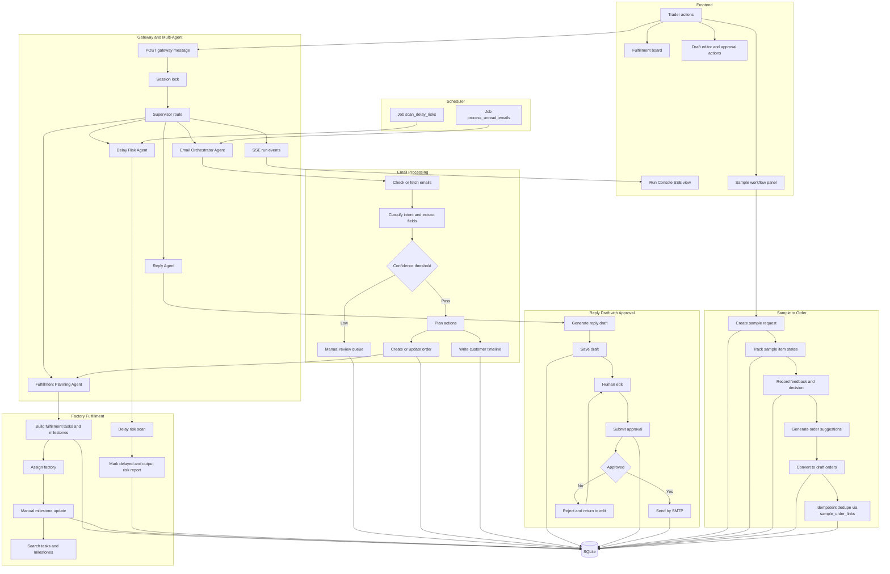

# RiceWatcher AI Agent Workflow

```mermaid
flowchart TD
    subgraph FE[Frontend]
        U[Trader actions]
        RC[Run Console SSE view]
        RB[Fulfillment board]
        SM[Sample workflow panel]
        DA[Draft editor and approval actions]
    end

    subgraph GW[Gateway and Multi-Agent]
        G1[POST gateway message]
        G2[Session lock]
        G3[Supervisor route]
        AG1[Email Orchestrator Agent]
        AG2[Reply Agent]
        AG3[Fulfillment Planning Agent]
        AG4[Delay Risk Agent]
        SSE[SSE run events]
    end

    subgraph EM[Email Processing]
        E1[Check or fetch emails]
        E2[Classify intent and extract fields]
        E3{Confidence threshold}
        E4[Manual review queue]
        E5[Plan actions]
        E6[Create or update order]
        E7[Write customer timeline]
    end

    subgraph RP[Reply Draft with Approval]
        R1[Generate reply draft]
        R2[Save draft]
        R3[Human edit]
        R4[Submit approval]
        R5{Approved}
        R6[Send by SMTP]
        R7[Reject and return to edit]
    end

    subgraph FF[Factory Fulfillment]
        F1[Build fulfillment tasks and milestones]
        F2[Assign factory]
        F3[Manual milestone update]
        F4[Search tasks and milestones]
        F5[Delay risk scan]
        F6[Mark delayed and output risk report]
    end

    subgraph SF[Sample to Order]
        S1[Create sample request]
        S2[Track sample item states]
        S3[Record feedback and decision]
        S4[Generate order suggestions]
        S5[Convert to draft orders]
        S6[Idempotent dedupe via sample_order_links]
    end

    U --> G1
    U --> RB
    U --> SM
    U --> DA
    G1 --> G2 --> G3
    G3 --> AG1
    G3 --> AG2
    G3 --> AG3
    G3 --> AG4
    G3 --> SSE --> RC

    AG1 --> E1 --> E2 --> E3
    E3 -->|Low| E4
    E3 -->|Pass| E5 --> E6
    E5 --> E7

    AG2 --> R1 --> R2 --> R3 --> R4 --> R5
    R5 -->|Yes| R6
    R5 -->|No| R7 --> R3

    E6 --> AG3
    AG3 --> F1 --> F2 --> F3 --> F4
    AG4 --> F5 --> F6

    SM --> S1 --> S2 --> S3 --> S4 --> S5 --> S6

    subgraph SCH[Scheduler]
        J1[Job process_unread_emails]
        J2[Job scan_delay_risks]
    end

    J1 --> AG1
    J2 --> AG4

    DB[(SQLite)]
    E4 --> DB
    E6 --> DB
    E7 --> DB
    R2 --> DB
    R4 --> DB
    R6 --> DB
    F1 --> DB
    F3 --> DB
    F6 --> DB
    S1 --> DB
    S2 --> DB
    S3 --> DB
    S5 --> DB
    S6 --> DB
```
